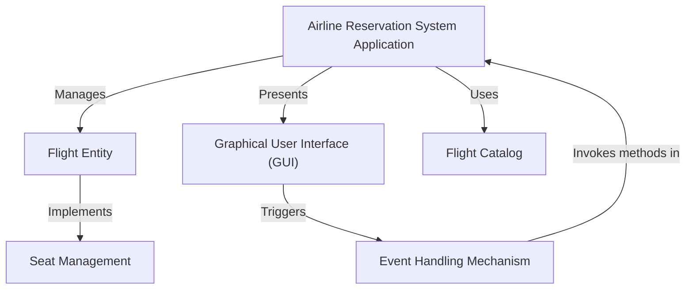

# Tutorial: Airline-Management-System

This project is an **Airline Reservation System** that lets you easily *manage your flight bookings*. You can **view available flights**, *book a seat* on a specific flight, or even **cancel a reservation** if your plans change, all through a simple visual interface.

## Visual Overview

## Chapters

1. [Graphical User Interface (GUI)
](01_graphical_user_interface__gui__.md)
2. [Airline Reservation System Application
](02_airline_reservation_system_application_.md)
3. [Flight Entity
](03_flight_entity_.md)
4. [Flight Catalog
](04_flight_catalog_.md)
5. [Seat Management
](05_seat_management_.md)
6. [Event Handling Mechanism
](06_event_handling_mechanism_.md)

---

