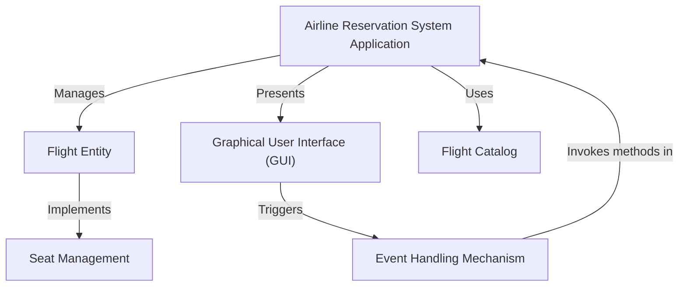
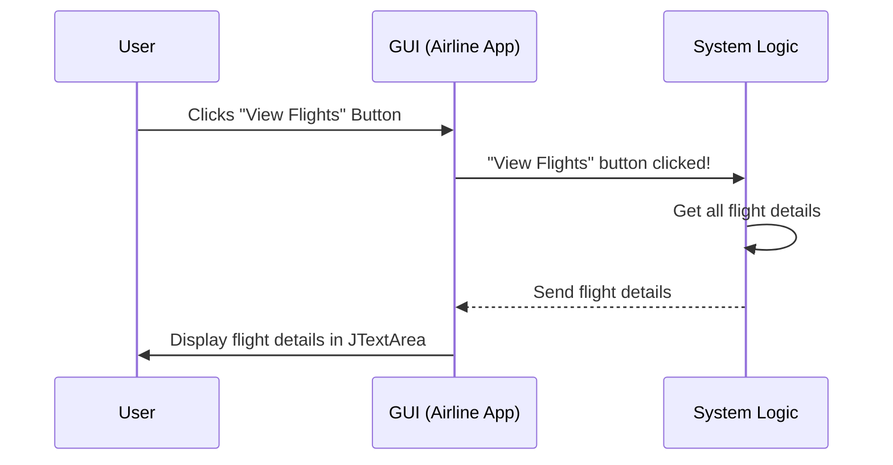
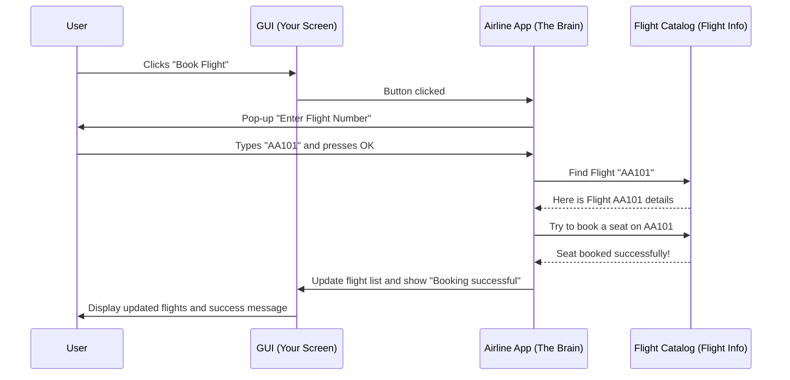
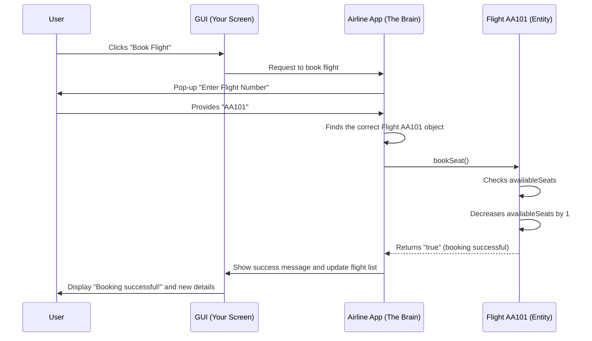
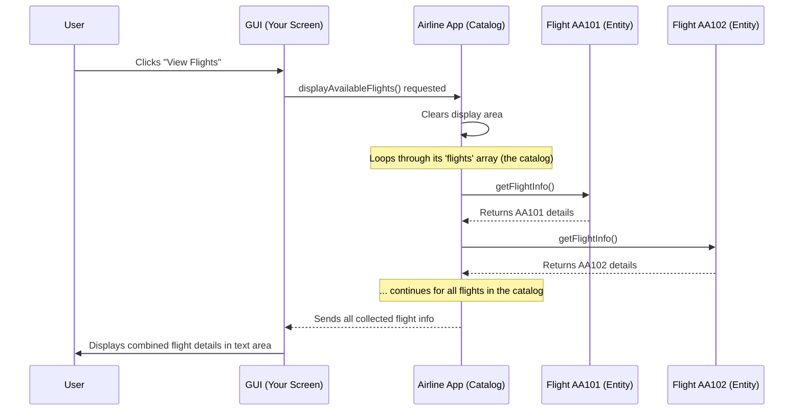
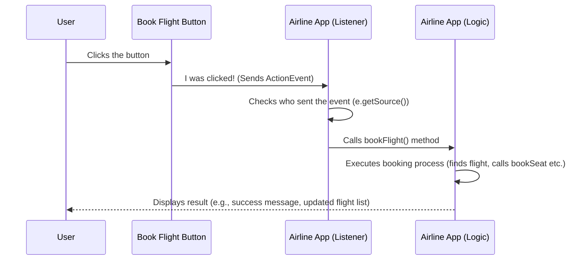

# Tutorial: Airline-Management-System

This project is an **Airline Reservation System** that lets you easily *manage your flight bookings*. You can **view available flights**, *book a seat* on a specific flight, or even **cancel a reservation** if your plans change, all through a simple visual interface.


## Visual Overview



## Chapters

1. [Graphical User Interface (GUI)
](01_graphical_user_interface__gui__.md)
2. [Airline Reservation System Application
](02_airline_reservation_system_application_.md)
3. [Flight Entity
](03_flight_entity_.md)
4. [Flight Catalog
](04_flight_catalog_.md)
5. [Seat Management
](05_seat_management_.md)
6. [Event Handling Mechanism
](06_event_handling_mechanism_.md)

---
# Chapter 1: Graphical User Interface (GUI)

Welcome to the Airline Management System tutorial! In this first chapter, we're going to explore something super important for any computer program that people use: the **Graphical User Interface (GUI)**.

### What is a GUI?

Imagine you're at an airport, and you want to book a flight. Would you prefer to shout commands at a computer screen, or would you like to see a friendly screen with buttons like "View Flights," "Book Now," and "Cancel"? Most likely, you'd choose the friendly screen!

That friendly screen, with all its buttons, text boxes, and pictures, is exactly what a **Graphical User Interface (GUI)** is!

Think of a GUI like the dashboard of a car. You don't need to understand how the engine works to turn on the lights or press the gas pedal. You just interact with the buttons, dials, and screens. Similarly, a GUI helps you use a computer program without needing to know all the complex code behind it. It's the "front desk" of our Airline Management System.

### Why Do We Need a GUI?

For our Airline Management System, a GUI solves a big problem: **how do passengers easily interact with the system?**

Without a GUI, a passenger would have to type out complicated commands like:
`bookFlight("AA101", "John Doe", "Economy");`

This is not easy for everyone! With a GUI, the passenger just sees a button that says "Book Flight," clicks it, and then maybe types the flight number into a simple box. Much easier, right?

The GUI makes our Airline Management System:
*   **Intuitive**: Easy to understand what to do.
*   **User-friendly**: Pleasant and simple to use.
*   **Accessible**: Anyone can use it without special training.

### Core Components of a GUI

Let's look at the basic building blocks that make up a GUI, especially in our Airline Management System:

| Component Type    | What it Does                                        | Analogy (Car Dashboard)                 |
| :---------------- | :-------------------------------------------------- | :-------------------------------------- |
| **Window (JFrame)** | The main "frame" or screen where everything appears. | The entire dashboard frame itself.      |
| **Text Area (JTextArea)** | A box where lots of text or information is displayed. | The screen showing your speed or radio. |
| **Buttons (JButton)** | Clickable items that make something happen.         | Buttons for turning on wipers or lights. |
| **Input Dialog (JOptionPane)** | A small pop-up box asking you for information.      | A small message popping up on the screen asking for confirmation. |

Our `AirlineReservationSystemGUI.java` file uses these components to build the visual interface. Let's see how our system puts these pieces together.

### Building Our Airline System's GUI

The core of our GUI is built using a special window, and then we add areas to show information and buttons to perform actions.

#### 1. The Main Window

Every GUI needs a main window for everything to appear in. In Java, we use `JFrame` for this. Our `AirlineReservationSystemGUI` class itself becomes this main window!

```java
import javax.swing.*; // Needed for JFrame, JButton, JTextArea, etc.
import java.awt.*;    // Needed for layout managers like BorderLayout.
// ... other imports ...

public class AirlineReservationSystemGUI extends JFrame implements ActionListener {

    // Constructor to setup the GUI
    public AirlineReservationSystemGUI() {
        // ... other code ...
        setTitle("Airline Reservation System"); // Sets the window's title
        setSize(600, 400);                     // Sets window size (width, height)
        setDefaultCloseOperation(JFrame.EXIT_ON_CLOSE); // What happens when you close the window
        setLayout(new BorderLayout());         // How components are arranged
        // ... more GUI setup ...
    }
    // ... rest of the class ...
}
```

In this code:
*   `extends JFrame` means our `AirlineReservationSystemGUI` *is* a window.
*   `setTitle`, `setSize`, `setDefaultCloseOperation`, and `setLayout` are like setting up the basic properties of our car's dashboard.

#### 2. Displaying Flight Information

We need a place to show all the available flights and their details. For this, we use a `JTextArea`.

```java
// ... inside AirlineReservationSystemGUI constructor ...
    private JTextArea flightDetailsArea; // This variable will hold our text area

    // Panel for flight info (like a section on the dashboard)
    JPanel flightPanel = new JPanel();
    // ... layout setup for flightPanel ...

    // Create the text area
    flightDetailsArea = new JTextArea(10, 50); // 10 rows, 50 columns
    flightDetailsArea.setEditable(false);      // Users can't type here
    flightPanel.add(new JScrollPane(flightDetailsArea)); // Add scrollbar if text is long
// ...
```

Here, `flightDetailsArea` is where you'll see details like "Flight Number: AA101", "Source: New York", etc. We make it `setEditable(false)` so users can only read, not change, the flight information directly. The `JScrollPane` is added so you can scroll down if there are many flights.

#### 3. Buttons for Actions

To let users *do* things, we add buttons. Each button will have a label, like "View Flights".

```java
// ... inside AirlineReservationSystemGUI constructor ...
    private JButton btnViewFlights, btnBookFlight, btnCancelBooking, btnExit;

    // Panel for buttons
    JPanel buttonPanel = new JPanel();
    // ... layout setup for buttonPanel ...

    // Create the buttons
    btnViewFlights = new JButton("View Flights");
    btnBookFlight = new JButton("Book Flight");
    btnCancelBooking = new JButton("Cancel Booking");
    btnExit = new JButton("Exit");

    // Add buttons to the panel
    buttonPanel.add(btnViewFlights);
    buttonPanel.add(btnBookFlight);
    buttonPanel.add(btnCancelBooking);
    buttonPanel.add(btnExit);
// ...
```

These lines create the actual buttons you will click on. For now, they just sit there, but soon we'll see how they become interactive.

#### 4. Getting User Input

When you want to book a flight, the system needs to know *which* flight. Instead of a permanent text box, our system uses a quick pop-up window called an `JOptionPane.showInputDialog` to ask for the flight number.

```java
// ... inside bookFlight() method ...
    private void bookFlight() {
        // This line creates a pop-up window asking for input
        String flightNumber = JOptionPane.showInputDialog(this, "Enter Flight Number to Book:");
        // The text typed by the user is stored in 'flightNumber' variable
        // ... rest of booking logic ...
    }
// ...
```
When you click "Book Flight", a small window will appear, asking "Enter Flight Number to Book:". You type your answer there.

### How the GUI Works: An Interaction Flow

So, you have a window, a text area, and some buttons. How does clicking a button actually *do* something? This is where **event handling** comes in, which is the system's way of listening for things happening (like a button click) and then reacting. We will cover this in more detail in [Event Handling Mechanism](06_event_handling_mechanism_.md). For now, let's see a simple flow:



In this diagram:
1.  The **User** (you!) clicks a button on the **GUI**.
2.  The **GUI** (our `AirlineReservationSystemGUI` window) detects this click.
3.  The GUI then tells the **System Logic** (the code that handles what to do) that a specific button was clicked.
4.  The **System Logic** does its job (like gathering all flight information).
5.  The **System Logic** sends the results back to the **GUI**.
6.  Finally, the **GUI** updates itself to show the results to the **User** (e.g., displaying the flight list in the text area).

### Making it All Run

To make our GUI application appear on your screen, we need a special part of the code, usually in the `main` method:

```java
public class AirlineReservationSystemGUI extends JFrame implements ActionListener {
    // ... all the GUI setup and methods ...

    public static void main(String[] args) {
        // This line makes sure the GUI starts correctly
        SwingUtilities.invokeLater(() -> {
            new AirlineReservationSystemGUI().setVisible(true); // Create and show the window
        });
    }
}
```
The `main` method is the starting point of any Java program. `SwingUtilities.invokeLater` is a special command that tells Java to start our GUI in a safe way, so it appears correctly. `new AirlineReservationSystemGUI().setVisible(true)` creates our GUI window and then makes it visible on your screen!

### Conclusion

In this chapter, we've learned that a **Graphical User Interface (GUI)** is the visual and interactive part of a computer program. It's like the friendly "front desk" of our Airline Management System, allowing users to easily view flights, book, and cancel bookings without needing to understand complex code. We saw how `JFrame` creates the main window, `JTextArea` displays information, `JButton` lets users take actions, and `JOptionPane` helps get user input. We also had a peek at how clicking a button triggers an action behind the scenes.

Next, we'll dive deeper into how all these parts come together to form the complete [Airline Reservation System Application](02_airline_reservation_system_application_.md) and how different pieces of our code work together!

---

<sub><sup>**References**: [[1]](https://github.com/Hack-Stone/Airline-Management-System/blob/ad4c984c7ac62b7ff91058a5eca9668a5a4cf1c3/AirlineReservationSystemGUI.java), [[2]](https://github.com/Hack-Stone/Airline-Management-System/blob/ad4c984c7ac62b7ff91058a5eca9668a5a4cf1c3/Notes.txt)</sup></sub>

# Chapter 2: Airline Reservation System Application

Welcome back! In [Chapter 1: Graphical User Interface (GUI)](01_graphical_user_interface__gui__.md), we learned about the friendly "face" of our Airline Management System – the buttons, text areas, and windows that you see and click on. But a friendly face isn't enough; we need a "brain" behind it that actually *does* things!

### What is the Airline Reservation System Application?

Imagine you're at the airport's main desk. You see screens (the GUI), and there are people (the underlying code) ready to help you. The entire desk, with all its computers, forms, and helpful staff, working together to manage flights and bookings, is like our **Airline Reservation System Application**.

This "Application" is the **central program** that brings all the pieces of our airline system together. It's the overall manager. It tells the GUI what to show, it knows about all the available flights, it handles booking and canceling tickets, and it keeps track of your reservations.

**The big problem it solves:** How do we make sure that when you click a "Book Flight" button (from the GUI), the system actually finds a flight, checks for available seats, updates the booking, and then shows you that it was successful? The Airline Reservation System Application is the conductor of this entire orchestra.

Let's think of a common task: **"A passenger wants to book a flight."** This is a perfect example of what our application manages from start to finish.

### The Main Program: Bringing It All Together

Our `AirlineReservationSystemGUI.java` file isn't just about the GUI; it actually *is* our "Airline Reservation System Application." It's one big program that contains everything needed to run the system.

When you run our program, what really happens?

#### 1. Starting the Application

Every Java program needs a starting point, like a "power on" button. This is done by a special part of the code called the `main` method.

```java
// File: AirlineReservationSystemGUI.java
public class AirlineReservationSystemGUI extends JFrame implements ActionListener {
    // ... other code ...

    public static void main(String[] args) {
        // This is where our entire application starts!
        SwingUtilities.invokeLater(() -> {
            new AirlineReservationSystemGUI().setVisible(true); // Create and show the main window
        });
    }
}
```
**What this code does:** The `main` method is like opening the airport's main desk for the day. It creates a new `AirlineReservationSystemGUI` object (which is our main window and the brain behind it) and then makes it visible on your computer screen. Once it's visible, the application is running and ready for you to interact with it!

#### 2. Setting Up the Application

When the `AirlineReservationSystemGUI` is created, it needs to set itself up. This happens in its **constructor** (a special method that runs when a new object is created).

```java
// File: AirlineReservationSystemGUI.java
public class AirlineReservationSystemGUI extends JFrame implements ActionListener {
    // ... variables for GUI components and flights ...
    private Flight[] flights = new Flight[3]; // To store our flights

    // Constructor: This runs when `new AirlineReservationSystemGUI()` is called
    public AirlineReservationSystemGUI() {
        // 1. Prepare some flights for our system
        flights[0] = new Flight("AA101", "New York", "Los Angeles", 100);
        flights[1] = new Flight("AA102", "Chicago", "San Francisco", 150);
        // ... more flights ...

        // 2. Setup the main window (as learned in Chapter 1)
        setTitle("Airline Reservation System");
        setSize(600, 400);
        setDefaultCloseOperation(JFrame.EXIT_ON_CLOSE);
        setLayout(new BorderLayout());

        // 3. Create and add all GUI buttons, text areas, etc.
        // ... code to initialize flightDetailsArea, buttons, etc. ...

        // 4. Tell buttons what to do when clicked
        btnViewFlights.addActionListener(this);
        btnBookFlight.addActionListener(this);
        // ... more button listeners ...
    }
    // ... rest of the class ...
}
```
**What this code does:** When the application starts, this constructor is like the airport manager setting up the desk.
1.  It creates a few sample flights (we'll learn more about `Flight` in [Chapter 3: Flight Entity](03_flight_entity_.md)).
2.  It sets up the main window (its title, size, and how it closes).
3.  It creates all the visual parts of the GUI (text areas, buttons, etc.) and places them on the window.
4.  Crucially, it prepares the buttons to *listen* for clicks, so when you click "Book Flight," the system knows to react (this "listening" is called event handling, which we'll explore in [Chapter 6: Event Handling Mechanism](06_event_handling_mechanism_.md)).

### How the Application Manages "Booking a Flight"

Let's trace our use case: **"A passenger wants to book a flight."**

When you, the user, interact with the system, the `AirlineReservationSystemGUI` application coordinates everything.



**Step-by-step Explanation:**

1.  **User Action:** You, the `User`, click the "Book Flight" button on the `GUI (Your Screen)`.
2.  **GUI Notifies Application:** The `GUI` (our `AirlineReservationSystemGUI` instance) detects this click and tells the main `Airline App (The Brain)` that the "Book Flight" action has occurred.
3.  **Application Asks for Input:** The `Airline App` then uses a small pop-up window (`JOptionPane`) to ask you for the specific flight number you want to book.
4.  **User Provides Input:** You type "AA101" (or any flight number) and press OK.
5.  **Application Finds Flight:** The `Airline App` then goes to its `Flight Catalog` (which is just the list of `Flight` objects it holds) and searches for the flight "AA101".
6.  **Flight Details Returned:** The `Flight Catalog` provides the details of "AA101" back to the `Airline App`.
7.  **Application Tries to Book:** The `Airline App` tells the found `Flight` object to `bookSeat()`. The `Flight` object checks if there are seats and updates its `availableSeats` count.
8.  **Booking Result:** The `Flight` object reports back to the `Airline App` whether the booking was successful.
9.  **Application Updates GUI:** Based on the booking result, the `Airline App` updates the `GUI` (by calling `displayAvailableFlights()` and `JOptionPane.showMessageDialog()`).
10. **GUI Shows Result:** The `GUI` then updates the `JTextArea` with the new flight details (showing one less seat for AA101) and displays a "Booking successful!" message to the `User`.

This entire process, from your click to the final message, is managed and coordinated by the `Airline Reservation System Application` (our `AirlineReservationSystemGUI` class).

#### The Booking Code in Action

Let's look at a simplified version of the `bookFlight` method within our `AirlineReservationSystemGUI` class:

```java
// File: AirlineReservationSystemGUI.java
// ... inside AirlineReservationSystemGUI class ...
private void bookFlight() {
    // 1. Get flight number from the user via a pop-up
    String flightNumber = JOptionPane.showInputDialog(this, "Enter Flight Number to Book:");
    if (flightNumber == null || flightNumber.trim().isEmpty()) {
        return; // User cancelled or entered nothing
    }

    // 2. Loop through all our flights to find the one
    for (Flight flight : flights) { // 'flights' is the array of Flight objects
        if (flight.flightNumber.equals(flightNumber.trim())) {
            // 3. If found, try to book a seat
            if (flight.bookSeat()) { // This calls a method on the Flight object itself
                JOptionPane.showMessageDialog(this, "Booking successful!");
                displayAvailableFlights(); // Update the display
                return; // Job done
            } else {
                JOptionPane.showMessageDialog(this, "Sorry, no seats available.");
                return; // Job done
            }
        }
    }
    // If we reach here, flight was not found
    JOptionPane.showMessageDialog(this, "Flight not found.");
}
```
**What this code does:** This method is the "how-to-book-a-flight" guide for our application.
1.  It first pops up a window asking for the flight number.
2.  Then, it looks through all the flights it knows about (stored in the `flights` array).
3.  When it finds the matching flight, it tells that specific `Flight` object to "book a seat" using `flight.bookSeat()`. (We'll see how `Flight` manages seats in [Chapter 5: Seat Management](05_seat_management_.md)).
4.  Finally, it tells the user if the booking worked or failed, and updates the flight list on the screen.

### Conclusion

In this chapter, we've understood that the **Airline Reservation System Application** is the main program that acts as the central control for our entire system. It's not just the visual GUI, but the "brain" that coordinates all actions, manages flight data, processes bookings, and makes sure everything runs smoothly. We saw how it starts, sets itself up, and orchestrates tasks like booking a flight, bringing together the GUI, flight information, and booking rules.

Next, we'll zoom in on one of the most important pieces of information the application manages: the details about each [Flight Entity](03_flight_entity_.md) itself!

---

<sub><sup>**References**: [[1]](https://github.com/Hack-Stone/Airline-Management-System/blob/ad4c984c7ac62b7ff91058a5eca9668a5a4cf1c3/AirlineReservationSystemGUI.java), [[2]](https://github.com/Hack-Stone/Airline-Management-System/blob/ad4c984c7ac62b7ff91058a5eca9668a5a4cf1c3/Notes.txt)</sup></sub>
# Chapter 3: Flight Entity

Welcome back! In [Chapter 2: Airline Reservation System Application](02_airline_reservation_system_application_.md), we learned that our `Airline Reservation System Application` is the central "brain" that manages everything. It takes your clicks, processes requests, and shows you results. But what *exactly* does this brain manage? It manages flights!

### What is a Flight Entity?

Imagine an airport. There are many different flights: Flight AA101 to Los Angeles, Flight BA202 to London, Flight UA303 to Chicago. Each of these is a unique, specific trip with its own details.

In our Airline Management System, we need a way to represent *each one of these specific flights*. This is where the concept of a **Flight Entity** comes in.

A **Flight Entity** is like a digital passport for a single flight. It's a way for our computer program to store and keep track of all the important information about one particular flight. Think of it like a specific bus or train trip that independently keeps track of its own capacity and seat availability.

**The big problem it solves:** How do we make sure that when you book a seat on "Flight AA101", only *that* flight's seats are updated, and not Flight BA202's? The `Flight Entity` solves this by giving each flight its own independent record and set of rules.

Let's consider a common task: **"A passenger wants to know details about Flight AA101 and book a seat on it."** This is a perfect example of why we need a `Flight Entity` – we need to interact with `AA101` specifically.

### Key Details of a Flight Entity

Every `Flight Entity` needs to hold specific pieces of information about *itself*. These are like the "features" of a flight:

| Detail (Property)   | What it Means                                         | Example for Flight AA101 |
| :------------------ | :---------------------------------------------------- | :----------------------- |
| **Flight Number**   | A unique code for this specific flight.               | `AA101`                  |
| **Source**          | The city where the flight starts.                     | `New York`               |
| **Destination**     | The city where the flight ends.                       | `Los Angeles`            |
| **Total Seats**     | The maximum number of seats on this airplane.         | `100`                    |
| **Available Seats** | How many seats are currently open for booking.        | `95` (if 5 are booked)   |

These details are specific to *each* flight. Flight AA101 has its own source, destination, and seat counts, separate from Flight BA202.

Beyond just holding information, a `Flight Entity` can also *do* things related to its own details. These are like "actions" a flight can perform:

| Action (Method)     | What it Does                                          |
| :------------------ | :---------------------------------------------------- |
| `getFlightInfo()`   | Gives you a nicely formatted summary of its details.  |
| `bookSeat()`        | Tries to book one seat on *this* flight.              |
| `cancelBooking()`   | Frees up one seat on *this* flight.                   |

### How Our Application Uses Flight Entities

From [Chapter 2: Airline Reservation System Application](02_airline_reservation_system_application_.md), you know that our `Airline Reservation System Application` is the "brain". This brain works by talking to individual `Flight Entity` objects.

When you want to **book a seat on Flight AA101**, the application does not just magically update a global seat count. Instead:
1.  It first finds the specific `Flight Entity` for "AA101".
2.  Then, it politely asks *that* `Flight Entity` to "book a seat".
3.  The `Flight Entity` then internally reduces *its own* `availableSeats` count.

This way, each `Flight Entity` is responsible for managing its own seats, making the system organized and less prone to errors.

### Inside the Flight Entity: The `Flight` Class

In our Java code, a `Flight Entity` is created from something called a `Flight` **class**. A class is like a blueprint or a cookie cutter for making many similar objects (entities).

Let's look at the simple structure of our `Flight` class found in `AirlineReservationSystemGUI.java`:

```java
// File: AirlineReservationSystemGUI.java (inside this file, there's a Flight class)
class Flight {
    String flightNumber;     // Stores the flight's unique number
    String source;           // Stores the starting city
    String destination;      // Stores the ending city
    int totalSeats;          // Stores the maximum capacity
    int availableSeats;      // Stores the current number of free seats

    // ... Constructor and methods go here ...
}
```
**What this code does:** This part defines the "properties" or "attributes" that every `Flight` entity will have. When we create a specific flight, like `AA101`, these variables (`flightNumber`, `source`, etc.) will hold its specific values.

#### Creating a New Flight Entity (The Constructor)

When our application starts, it needs to create a few `Flight` entities. This is done using a special method called a **constructor**. Think of it as the setup guide that tells our `Flight` entity how to be born and what its initial details are.

```java
// File: AirlineReservationSystemGUI.java (part of the Flight class)
class Flight {
    // ... variables ...

    // This is the constructor: it runs when a new Flight is created
    public Flight(String flightNumber, String source, String destination, int totalSeats) {
        this.flightNumber = flightNumber;     // Store the flight number provided
        this.source = source;                 // Store the source city
        this.destination = destination;       // Store the destination city
        this.totalSeats = totalSeats;         // Store the total seats
        this.availableSeats = totalSeats;     // Initially, all seats are available!
    }
    // ... other methods ...
}
```
**What this code does:** When our `AirlineReservationSystemGUI` creates flights (as seen in [Chapter 2](02_airline_reservation_system_application_.md)), it might do something like `new Flight("AA101", "New York", "Los Angeles", 100);`. This constructor then takes those details and stores them in the `flightNumber`, `source`, etc., variables *for that specific `Flight` entity*. Notice how `availableSeats` starts out equal to `totalSeats` because no one has booked yet!

#### Getting Flight Information (`getFlightInfo()`)

Each `Flight` entity can tell us about itself.

```java
// File: AirlineReservationSystemGUI.java (part of the Flight class)
class Flight {
    // ... variables and constructor ...

    // Method to display flight details
    public String getFlightInfo() {
        return "Flight Number: " + flightNumber + "\nSource: " + source +
                "\nDestination: " + destination + "\nTotal Seats: " + totalSeats +
                "\nAvailable Seats: " + availableSeats + "\n";
    }
    // ... other methods ...
}
```
**What this code does:** When our application calls `someFlightObject.getFlightInfo()`, this method collects all the information stored within `someFlightObject` and combines it into a nice, readable text message.

#### Booking a Seat (`bookSeat()`)

This is where a `Flight` entity manages its own seat availability.

```java
// File: AirlineReservationSystemGUI.java (part of the Flight class)
class Flight {
    // ... variables, constructor, getFlightInfo() ...

    // Method to book a seat
    public boolean bookSeat() {
        if (availableSeats > 0) { // Check if there's at least one seat available
            availableSeats--;     // If yes, reduce the count of available seats by one
            return true;          // Tell the application: "Yes, I booked it!"
        }
        return false;             // Tell the application: "Sorry, no seats left."
    }
    // ... cancelBooking() ...
}
```
**What this code does:** When the `Airline App` tells a specific `Flight` entity (e.g., `Flight AA101`) to `bookSeat()`, that `Flight` entity checks its *own* `availableSeats`. If there's space, it updates *its own* count and confirms the booking. If not, it says no.

#### Canceling a Booking (`cancelBooking()`)

Similarly, a `Flight` entity can free up a seat.

```java
// File: AirlineReservationSystemGUI.java (part of the Flight class)
class Flight {
    // ... variables, constructor, getFlightInfo(), bookSeat() ...

    // Method to cancel a booking
    public void cancelBooking() {
        // Only increase if we haven't reached the total capacity (can't have more seats than total!)
        if (availableSeats < totalSeats) {
            availableSeats++; // Increase the count of available seats by one
        }
    }
}
```
**What this code does:** When the `Airline App` tells a `Flight` entity to `cancelBooking()`, that `Flight` entity increases its *own* `availableSeats` count, making one more seat available.

### How Booking Works with a Flight Entity

Let's trace how our example "A passenger wants to know details about Flight AA101 and book a seat on it" plays out, focusing on the `Flight AA101 (Entity)`:


In this flow, `Flight AA101 (Entity)` is the specific object that holds its own seat count and updates it when asked by the `Airline App`.

### Flight Entity in the Main Application Code

As we saw in [Chapter 2](02_airline_reservation_system_application_.md), the `AirlineReservationSystemGUI` (our main application) has a method called `bookFlight()`. Now you can see exactly how it uses the `Flight` entity:

```java
// File: AirlineReservationSystemGUI.java (simplified bookFlight method)
public class AirlineReservationSystemGUI extends JFrame implements ActionListener {
    // ... other GUI components and methods ...
    private Flight[] flights = new Flight[3]; // An array to hold our Flight entities

    // ... constructor where flights are initialized like:
    // flights[0] = new Flight("AA101", "New York", "Los Angeles", 100);

    private void bookFlight() {
        // 1. Ask the user for the flight number (e.g., "AA101")
        String flightNumber = JOptionPane.showInputDialog(this, "Enter Flight Number to Book:");
        if (flightNumber == null || flightNumber.trim().isEmpty()) {
            return; // User cancelled or entered nothing
        }

        // 2. Loop through our list of Flight entities to find the right one
        for (Flight flight : flights) { // 'flights' holds all our Flight objects
            if (flight.flightNumber.equals(flightNumber.trim())) {
                // 3. We found the correct Flight entity! Now tell IT to book a seat.
                if (flight.bookSeat()) { // Calls the bookSeat() method on THAT specific flight
                    JOptionPane.showMessageDialog(this, "Booking successful!");
                    displayAvailableFlights(); // Update the display with new seat counts
                    return; // Job done
                } else {
                    JOptionPane.showMessageDialog(this, "Sorry, no seats available.");
                    return; // No seats, job done
                }
            }
        }
        // If the loop finishes without finding the flight
        JOptionPane.showMessageDialog(this, "Flight not found.");
    }
    // ... rest of the class ...
}
```
**What this code does:** When you click "Book Flight" and type "AA101", this code searches through the `flights` array (which contains all our `Flight` entities) until it finds the `Flight` entity with `flightNumber` "AA101". Once found, it then calls `flight.bookSeat()` on *that specific `Flight` entity*, letting that entity manage its own seat availability.

### Conclusion

In this chapter, we've learned that a **Flight Entity** is a fundamental building block in our Airline Management System. It's a self-contained unit (an "object" from a "class") that represents a single flight, holding all its unique details (number, source, destination, total seats, available seats) and managing its own seat availability through methods like `bookSeat()` and `cancelBooking()`. By having each flight be its own "entity," our system can easily keep track of many different flights independently.

Next, we'll see how our application manages *many* of these `Flight` entities together in a collection called the [Flight Catalog](04_flight_catalog_.md)!

---

<sub><sup>**References**: [[1]](https://github.com/Hack-Stone/Airline-Management-System/blob/ad4c984c7ac62b7ff91058a5eca9668a5a4cf1c3/AirlineReservationSystemGUI.java), [[2]](https://github.com/Hack-Stone/Airline-Management-System/blob/ad4c984c7ac62b7ff91058a5eca9668a5a4cf1c3/Notes.txt)</sup></sub>
# Chapter 4: Flight Catalog

Welcome back! In [Chapter 3: Flight Entity](03_flight_entity_.md), we learned about the `Flight Entity` – a special "digital passport" for a *single* flight, holding all its unique details and managing its own seats. That's great for one flight, but an airline doesn't just have one flight, right? It has many! How do we keep track of *all* the different flights the airline offers?

### What is a Flight Catalog?

Imagine you walk into a library. You don't just see one book; you see shelves and shelves of them! To find a specific book, you might look at a computer system or a card catalog that lists all the books the library has.

In our Airline Management System, the **Flight Catalog** is just like that library's computer system or master list. It's the **central collection** or "database" of *all* the predefined flights that our airline offers. It's not one flight, but a list of *all* the `Flight Entity` objects that our system knows about from the start.

**The big problem it solves:** How do we easily find, display, and manage seat availability for *any* of the many flights the airline offers? The `Flight Catalog` provides a single, organized place to hold and access all these flight details.

Let's think of a common task: **"When the airline system starts, it needs to show all available flights to passengers so they can choose one to book."** This involves getting information from *every* flight, not just one. The `Flight Catalog` helps us do this efficiently.

### How Does Our System Use a Flight Catalog?

In our `Airline Reservation System Application` (the "brain" we discussed in [Chapter 2: Airline Reservation System Application](02_airline_reservation_system_application_.md)), the `Flight Catalog` is simply a list or array of `Flight` objects.

Here’s how it works:

1.  **System Starts**: When you launch the `Airline Reservation System GUI` (our main application), it first creates a few example `Flight Entity` objects.
2.  **Populating the Catalog**: These newly created `Flight` objects are then placed into our `Flight Catalog` (which is just an array of `Flight` objects). This acts like stocking the library shelves with new books.
3.  **Referencing Flights**: When you want to "View Flights," the system looks at this `Flight Catalog` and gets information from each `Flight` object inside it.
4.  **Managing Seats**: When you "Book a Flight," the system first looks up the correct `Flight Entity` in the `Flight Catalog`, and then tells *that specific `Flight Entity`* to update its seats (as we saw in [Chapter 3](03_flight_entity_.md)).

### The Flight Catalog in Our Code

In our `AirlineReservationSystemGUI.java` file, the `Flight Catalog` is represented by an array of `Flight` objects. An "array" is like a simple list with numbered slots to hold things.

#### 1. Declaring the Catalog

First, our application needs a place to hold this list of flights:

```java
// File: AirlineReservationSystemGUI.java
public class AirlineReservationSystemGUI extends JFrame implements ActionListener {

    // ... other GUI components ...

    // This is our Flight Catalog! An array that can hold 3 Flight objects.
    private Flight[] flights = new Flight[3];

    // ... constructor and methods ...
}
```
**What this code does:** This line declares a variable named `flights`. It's an array designed to store up to 3 `Flight` objects. Think of it as reserving space for 3 items in our "catalog."

#### 2. Populating the Catalog When the System Starts

When our `AirlineReservationSystemGUI` is created (in its constructor, as discussed in [Chapter 2](02_airline_reservation_system_application_.md)), we create specific `Flight` entities and put them into our `flights` array.

```java
// File: AirlineReservationSystemGUI.java (inside the constructor)
public class AirlineReservationSystemGUI extends JFrame implements ActionListener {
    // ... flights array declaration ...

    // Constructor to setup the GUI and populate the catalog
    public AirlineReservationSystemGUI() {
        // Here we create Flight Entities and add them to our 'flights' catalog
        flights[0] = new Flight("AA101", "New York", "Los Angeles", 100);
        flights[1] = new Flight("AA102", "Chicago", "San Francisco", 150);
        flights[2] = new Flight("AA103", "Miami", "Dallas", 120);

        // ... rest of GUI setup ...
    }
    // ... rest of the class ...
}
```
**What this code does:** These lines are like stocking the library with specific books. `flights[0]` means the first slot in our catalog, `flights[1]` is the second, and so on. We are creating new `Flight` objects (our `Flight Entities` from [Chapter 3](03_flight_entity_.md)) and placing them directly into our `flights` array. Now our `Flight Catalog` has three predefined flights!

#### 3. Using the Catalog: Displaying All Flights

Now let's see how our application uses this catalog to solve our use case: **"Show all available flights to passengers."**

When you click the "View Flights" button, the `displayAvailableFlights()` method is called. This method simply goes through *every* `Flight` object in our `flights` catalog and asks each one for its information.

```java
// File: AirlineReservationSystemGUI.java (inside the AirlineReservationSystemGUI class)
private void displayAvailableFlights() {
    flightDetailsArea.setText(""); // Clear the text area first
    for (Flight flight : flights) { // Loop through EACH Flight in our 'flights' catalog
        flightDetailsArea.append(flight.getFlightInfo()); // Ask this Flight for its info
        flightDetailsArea.append("--------------------------------------\n"); // Add a separator
    }
}
```
**What this code does:**
-   `for (Flight flight : flights)`: This special loop goes through each `Flight` object one by one from our `flights` array (our catalog).
-   `flight.getFlightInfo()`: For *each* `Flight` object it finds, it calls its `getFlightInfo()` method (from [Chapter 3](03_flight_entity_.md)) to get its details.
-   `flightDetailsArea.append()`: The collected details for each flight are then added to the `JTextArea` on the GUI, showing all flights to the user.

**Example Output (in the GUI's text area):**
```
Flight Number: AA101
Source: New York
Destination: Los Angeles
Total Seats: 100
Available Seats: 100
--------------------------------------
Flight Number: AA102
Source: Chicago
Destination: San Francisco
Total Seats: 150
Available Seats: 150
--------------------------------------
Flight Number: AA103
Source: Miami
Destination: Dallas
Total Seats: 120
Available Seats: 120
--------------------------------------
```
This output shows all the flights currently in our catalog, along with their initial seat availability.

#### 4. Using the Catalog: Booking a Specific Flight

When you want to "Book a Flight," the system again uses the `Flight Catalog` to find the *specific* flight you're interested in.

```java
// File: AirlineReservationSystemGUI.java (simplified bookFlight method)
private void bookFlight() {
    String flightNumber = JOptionPane.showInputDialog(this, "Enter Flight Number to Book:");
    // ... (code to handle empty input) ...

    // Loop through our Flight Catalog to find the correct flight
    for (Flight flight : flights) { // Go through each Flight in the catalog
        if (flight.flightNumber.equals(flightNumber)) { // Is this the one we're looking for?
            // Yes! Now tell THIS specific Flight to book a seat
            if (flight.bookSeat()) { // Calls bookSeat() on the found Flight Entity
                JOptionPane.showMessageDialog(this, "Booking successful!");
                displayAvailableFlights(); // Update the display to show new seat count
                return;
            } else {
                JOptionPane.showMessageDialog(this, "Sorry, no seats available.");
                return;
            }
        }
    }
    JOptionPane.showMessageDialog(this, "Flight not found.");
}
```
**What this code does:** This method iterates through the `flights` catalog (our `Flight[] flights` array) one by one. It checks each `Flight` object's `flightNumber` to see if it matches what the user typed. Once it finds a match, it stops searching and calls `bookSeat()` on *that specific `Flight` entity*. If it goes through the entire catalog and doesn't find a match, it tells the user "Flight not found."

### How "View Flights" Works Behind the Scenes

Let's trace our use case: **"When the airline system starts, it needs to show all available flights to passengers."**



**Step-by-step Explanation:**

1.  **User Action:** You, the `User`, click the "View Flights" button on the `GUI (Your Screen)`.
2.  **GUI Notifies Application:** The `GUI` tells the `Airline App (Catalog)` that the `displayAvailableFlights()` action is needed.
3.  **Application Prepares:** The `Airline App` first clears the display area on the GUI.
4.  **Application Iterates Catalog:** The `Airline App` then begins to loop through its internal `flights` array (which is our `Flight Catalog`).
5.  **Requests Info from Each Flight:** For each `Flight Entity` in the catalog (e.g., `Flight AA101 (Entity)`, `Flight AA102 (Entity)`), the `Airline App` calls its `getFlightInfo()` method.
6.  **Flights Provide Info:** Each `Flight Entity` returns its own specific details to the `Airline App`.
7.  **Application Collects and Sends:** The `Airline App` collects all this information from every `Flight Entity` in its catalog. Once it has all the details, it sends the combined text back to the `GUI`.
8.  **GUI Displays:** Finally, the `GUI` updates its `JTextArea` to show all the flight information to the `User`.

This process shows how the `Flight Catalog` (the `flights` array within the `Airline App`) allows us to manage and interact with many `Flight Entity` objects as a cohesive collection.

### Conclusion

In this chapter, we've learned that the **Flight Catalog** is the central collection of all `Flight Entity` objects that our airline offers. In our system, this catalog is simply an array of `Flight` objects (`Flight[] flights`) held by our main `AirlineReservationSystemGUI` application. It allows us to easily populate the system with predefined flights, display them all to the user, and find specific flights when needed for actions like booking or canceling.

Next, we'll dive deeper into how `Flight Entities` precisely manage the number of `Seat Management` for each flight, which is directly impacted by bookings and cancellations.

[Chapter 5: Seat Management](05_seat_management_.md)

---

</sup></sub> <sub><sup>**References**: [[1]](https://github.com/Hack-Stone/Airline-Management-System/blob/ad4c984c7ac62b7ff91058a5eca9668a5a4cf1c3/AirlineReservationSystemGUI.java), [[2]](https://github.com/Hack-Stone/Airline-Management-System/blob/ad4c984c7ac62b7ff91058a5eca9668a5a4cf1c3/Notes.txt)</sup></sub>
# Chapter 5: Seat Management

Welcome back! In [Chapter 4: Flight Catalog](04_flight_catalog_.md), we learned how our system keeps track of all the different [Flight Entity](03_flight_entity_.md) objects, like a master list of all the flights an airline offers. We saw how the system can display all flights and find a specific one. But what happens *after* you choose a flight? How does the system make sure your seat is reserved and no one else can book it?

### What is Seat Management?

Imagine you're at a concert, and you pick a specific seat: "Section A, Row 5, Seat 12." Once you buy that ticket, Seat 12 is no longer available for anyone else. If you decide not to go, and return your ticket, Seat 12 becomes available again for someone else to buy.

**Seat Management** in our Airline Management System is just like that! It's the core logic that handles reserving (allocating) and freeing up (deallocating) seats for specific flights. It's like having a dynamic, constantly updated seating chart for every single flight.

**The big problem it solves:** How do we make sure that a seat can only be booked if it's genuinely empty, and that it goes back to being empty when a booking is canceled? Seat Management ensures that no two passengers are accidentally assigned the same seat, and that the number of empty seats shown to new passengers is always correct.

Let's consider a common task: **"A passenger wants to book a seat on Flight AA101, and then later cancel it."** This is a perfect example of what Seat Management handles – updating the seat count for a specific flight.

### How Our System Manages Seats

You might be wondering, "Is there a 'Seat Management' class?" In our simple system, **Seat Management is handled directly by each individual [Flight Entity](03_flight_entity_.md)**. This means that each `Flight` object (like our `AA101` example) is responsible for managing its *own* seats, just like a specific concert venue manages its own seats, not all concert venues at once.

Each `Flight` entity keeps track of two crucial pieces of information for Seat Management:

| Detail            | What it Means                                         | Example for Flight AA101 |
| :---------------- | :---------------------------------------------------- | :----------------------- |
| `totalSeats`      | The fixed, maximum number of seats on this flight.    | `100`                    |
| `availableSeats`  | The current number of seats that are open for booking. | `95` (if 5 are booked)   |

And each `Flight` entity has special actions (methods) it can perform related to its seats:

| Action (Method)   | What it Does                                          |
| :---------------- | :---------------------------------------------------- |
| `bookSeat()`      | Tries to reduce `availableSeats` by one.              |
| `cancelBooking()` | Tries to increase `availableSeats` by one.            |

### How Booking a Seat Works

When you click "Book Flight" on the [Graphical User Interface (GUI)](01_graphical_user_interface__gui__.md), the [Airline Reservation System Application](02_airline_reservation_system_application_.md) (the "brain") needs to find the correct flight and then tell *that specific flight* to book a seat.

Let's look at the `bookSeat()` method inside our `Flight` class (from `AirlineReservationSystemGUI.java`):

```java
// File: AirlineReservationSystemGUI.java (part of the Flight class)
class Flight {
    // ... variables like flightNumber, source, destination, totalSeats ...
    int availableSeats; // This is key for seat management!

    // ... constructor and getFlightInfo() ...

    // Method to book a seat
    public boolean bookSeat() {
        if (availableSeats > 0) { // Is there at least one seat available?
            availableSeats--;     // Yes! Reduce the count by one.
            return true;          // Tell the system: "Booking successful!"
        }
        return false;             // No seats left. Tell the system: "Booking failed."
    }
    // ... cancelBooking() ...
}
```
**What this code does:**
1.  When `bookSeat()` is called for a specific `Flight` object (e.g., `AA101`), it first checks `if (availableSeats > 0)`. This is the core logic: *can* a seat be booked?
2.  If there's at least one seat available, it decreases `availableSeats` by `1`. This is how a seat becomes "taken."
3.  It then returns `true` to tell the calling part of the system (our `Airline App`) that the booking was successful.
4.  If `availableSeats` is `0` (or less, though it shouldn't go below zero), it returns `false`, meaning no seats were available.

**Example Input/Output:**
*   **Input:** `flightAA101.availableSeats` is `10`. Call `flightAA101.bookSeat()`.
*   **Output (internal):** `flightAA101.availableSeats` becomes `9`. The method returns `true`.
*   **Output (internal):** `flightAA101.availableSeats` is `0`. Call `flightAA101.bookSeat()`.
*   **Output (internal):** `flightAA101.availableSeats` remains `0`. The method returns `false`.

### How Cancelling a Booking Works

If a passenger decides to cancel their booking, the system needs to return that seat to the available pool.

Let's look at the `cancelBooking()` method inside our `Flight` class:

```java
// File: AirlineReservationSystemGUI.java (part of the Flight class)
class Flight {
    // ... variables, constructor, getFlightInfo(), bookSeat() ...

    // Method to cancel a booking
    public void cancelBooking() {
        // Only increase if we haven't reached the total capacity
        // (we can't have more available seats than the airplane's total seats!)
        if (availableSeats < totalSeats) {
            availableSeats++; // Increase the count of available seats by one
        }
    }
}
```
**What this code does:**
1.  When `cancelBooking()` is called for a `Flight` object, it first checks `if (availableSeats < totalSeats)`. This prevents the system from having more available seats than the airplane's actual capacity (which would be illogical).
2.  If there's room to increase (meaning a seat was previously booked), it increases `availableSeats` by `1`. This is how a seat becomes "free" again.

**Example Input/Output:**
*   **Input:** `flightAA101.availableSeats` is `99`, `flightAA101.totalSeats` is `100`. Call `flightAA101.cancelBooking()`.
*   **Output (internal):** `flightAA101.availableSeats` becomes `100`.
*   **Input:** `flightAA101.availableSeats` is `100`, `flightAA101.totalSeats` is `100`. Call `flightAA101.cancelBooking()`.
*   **Output (internal):** `flightAA101.availableSeats` remains `100` (it cannot exceed `totalSeats`).

### How "Book and Cancel" Works Behind the Scenes

Let's trace our use case: **"A passenger wants to book a seat on Flight AA101, and then later cancel it."**

```mermaid
sequenceDiagram
    participant User
    participant GUI (Your Screen)
    participant Airline App
    participant Flight AA101

    User->>GUI (Your Screen): Clicks "Book Flight"
    GUI (Your Screen)->>Airline App: "Book Flight" request
    Airline App->>User: Pop-up "Enter Flight Number"
    User->>Airline App: Types "AA101"
    Airline App->>Airline App: Finds Flight AA101 from its catalog
    Airline App->>Flight AA101: bookSeat()
    Flight AA101->>Flight AA101: Checks availableSeats; decreases by 1
    Flight AA101-->>Airline App: Returns true (success)
    Airline App->>GUI (Your Screen): Updates display; shows "Booking successful!"
    GUI (Your Screen)->>User: Displays updated flight details and message

    Note over User,GUI (Your Screen): Later...
    User->>GUI (Your Screen): Clicks "Cancel Booking"
    GUI (Your Screen)->>Airline App: "Cancel Booking" request
    Airline App->>User: Pop-up "Enter Flight Number"
    User->>Airline App: Types "AA101"
    Airline App->>Airline App: Finds Flight AA101 from its catalog
    Airline App->>Flight AA101: cancelBooking()
    Flight AA101->>Flight AA101: Checks availableSeats; increases by 1
    Flight AA101-->>Airline App: (No return value for cancel)
    Airline App->>GUI (Your Screen): Updates display; shows "Booking canceled!"
    GUI (Your Screen)->>User: Displays updated flight details and message
```

**Step-by-step Explanation:**

1.  **User Initiates Booking:** You, the `User`, click "Book Flight" on the `GUI`.
2.  **GUI Informs App:** The `GUI` tells the `Airline App` about your request.
3.  **App Gets Input:** The `Airline App` asks you for the flight number (e.g., "AA101") via a pop-up.
4.  **App Finds Flight:** The `Airline App` looks into its [Flight Catalog](04_flight_catalog_.md) to find the specific `Flight AA101` object.
5.  **App Asks Flight to Book:** The `Airline App` then tells *that specific `Flight AA101` object* to `bookSeat()`.
6.  **Flight Manages Seat:** `Flight AA101` checks its own `availableSeats`. If a seat is open, it reduces its `availableSeats` count by 1 and confirms success.
7.  **App Updates GUI:** The `Airline App` receives the success message, then updates the `GUI` to show the new flight details (with one less available seat) and a "Booking successful!" message.
8.  **User Sees Result:** The `GUI` displays the updated information to you.

The process for **Canceling** is very similar:
1.  **User Initiates Cancellation:** You click "Cancel Booking" on the `GUI`.
2.  **App Gets Input:** The `Airline App` asks for the flight number again.
3.  **App Finds Flight:** It finds the `Flight AA101` object.
4.  **App Asks Flight to Cancel:** The `Airline App` tells *that specific `Flight AA101` object* to `cancelBooking()`.
5.  **Flight Manages Seat:** `Flight AA101` checks its own `availableSeats`. If it's not already at full capacity, it increases its `availableSeats` count by 1.
6.  **App Updates GUI:** The `Airline App` updates the `GUI` to show the new flight details (with one more available seat) and a "Booking canceled!" message.
7.  **User Sees Result:** The `GUI` displays the updated information to you.

This entire process of updating seat counts is centralized within each `Flight` entity, making Seat Management robust and specific to each flight.

### Seat Management in the Main Application Code

The main [Airline Reservation System Application](02_airline_reservation_system_application_.md) (`AirlineReservationSystemGUI` class) handles the user interaction and then delegates (passes the task) the actual seat changes to the `Flight` entity.

Here's how the `bookFlight()` method in `AirlineReservationSystemGUI` uses the `Flight` entity for seat management:

```java
// File: AirlineReservationSystemGUI.java (simplified bookFlight method)
public class AirlineReservationSystemGUI extends JFrame implements ActionListener {
    // ... other GUI components and methods ...
    private Flight[] flights = new Flight[3]; // Our Flight Catalog

    // ... constructor ...

    private void bookFlight() {
        String flightNumber = JOptionPane.showInputDialog(this, "Enter Flight Number to Book:");
        // Check if user entered something or cancelled
        if (flightNumber == null || flightNumber.trim().isEmpty()) {
            return;
        }

        // Loop through our Flight Catalog to find the correct flight
        for (Flight flight : flights) {
            if (flight.flightNumber.equals(flightNumber.trim())) {
                // Found the flight! Now ask THIS flight to manage its seats.
                if (flight.bookSeat()) { // Calls the bookSeat() method on the found Flight object
                    JOptionPane.showMessageDialog(this, "Booking successful!");
                    displayAvailableFlights(); // Show updated seat counts
                } else {
                    JOptionPane.showMessageDialog(this, "Sorry, no available seats on this flight.");
                }
                return; // Stop searching once flight is found or not found
            }
        }
        JOptionPane.showMessageDialog(this, "Flight not found.");
    }
    // ... cancelBooking() method is similar ...
}
```
**What this code does:** When you request to book a flight, the `Airline App`'s `bookFlight()` method finds the right `Flight` object. Once found, it simply calls `flight.bookSeat()`. It doesn't need to know *how* `Flight` manages seats, just that `Flight` *can* manage its own seats. This is a powerful concept called **encapsulation**, where an object (the `Flight`) keeps its internal workings (like `availableSeats`) private and only provides methods (`bookSeat`, `cancelBooking`) for others to interact with it.

### Conclusion

In this chapter, we've explored **Seat Management**, which is the core logic for managing the allocation and deallocation of seats for specific flights. We learned that in our system, each [Flight Entity](03_flight_entity_.md) is responsible for managing its *own* seats using `totalSeats` and `availableSeats` properties, and through methods like `bookSeat()` and `cancelBooking()`. This ensures that seat counts are always accurate and that bookings are handled correctly for each individual flight.

Next, we'll dive into the [Event Handling Mechanism](06_event_handling_mechanism_.md), which is how our `Airline Reservation System Application` "listens" for your clicks on the GUI and then triggers all these actions we've been discussing, like viewing flights or booking seats!

---

</sup></sub> <sub><sup>**References**: [[1]](https://github.com/Hack-Stone/Airline-Management-System/blob/ad4c984c7ac62b7ff91058a5eca9668a5a4cf1c3/AirlineReservationSystemGUI.java), [[2]](https://github.com/Hack-Stone/Airline-Management-System/blob/ad4c984c7ac62b7ff91058a5eca9668a5a4cf1c3/Notes.txt)</sup></sub>
# Chapter 6: Event Handling Mechanism

Welcome back! In our previous chapter, [Chapter 5: Seat Management](05_seat_management_.md), we learned how each [Flight Entity](03_flight_entity_.md) is smart enough to manage its own seats, knowing when to `bookSeat()` and `cancelBooking()`. But how does our system know *when* a passenger wants to book a seat? How does it detect that you've clicked a button or typed something?

This is where the **Event Handling Mechanism** comes in!

### What is Event Handling?

Imagine our Airline Management System as a diligent receptionist at an airport. This receptionist isn't just sitting there; they are constantly *listening* and *watching* for specific signals.

*   When a passenger walks up and says, "I want to view flights," that's a signal.
*   When a passenger points to a "Book Flight" sign, that's another signal.

Our computer program needs to do the same thing. It needs to **detect** user actions (like mouse clicks or keyboard entries) and then **respond** to them immediately. This process of listening for signals and reacting is called **Event Handling**.

**The big problem it solves:** How do we make our [Graphical User Interface (GUI)](01_graphical_user_interface__gui__.md) interactive? Without Event Handling, our buttons would just sit there looking pretty, but nothing would happen when you clicked them! It's what makes the application alive and responsive to you.

Let's take our core use case: **"A passenger clicks the 'Book Flight' button on the screen."** Event Handling is the bridge that connects that click to the actual `bookFlight()` logic we discussed in [Chapter 2: Airline Reservation System Application](02_airline_reservation_system_application_.md).

### Key Concepts in Event Handling

To understand Event Handling, let's break it down into a few simple parts:

| Concept         | What it Means                                         | Analogy (Receptionist)                                |
| :-------------- | :---------------------------------------------------- | :---------------------------------------------------- |
| **Event**       | Something that happens (a signal!).                  | A passenger speaks, or points to a sign.              |
| **Event Source** | The object that *generates* the event.                | The passenger.                                        |
| **Event Listener** | A special "ear" that *listens* for specific events. | The receptionist's ear, trained to hear requests.     |
| **Event Handler** | The code that *reacts* when an event is detected.     | The receptionist's brain deciding what to do (e.g., "Oh, they said 'view flights', I should get the flight schedule!"). |

In our Java GUI, when you click a `JButton` (like "Book Flight"):
*   The **Event** is the "button click."
*   The **Event Source** is the `JButton` itself.
*   We need an **Event Listener** to hear that click.
*   And finally, the **Event Handler** is the code that actually performs the `bookFlight()` action.

### How Our System Handles Events (The `ActionListener` Way)

In our `AirlineReservationSystemGUI.java` application, we use a common way to handle events in Java Swing: the `ActionListener` interface. Think of an `interface` as a contract or a promise. If a class promises to be an `ActionListener`, it *must* have a special method called `actionPerformed`.

Here's how our `AirlineReservationSystemGUI` class uses these concepts to make buttons clickable:

#### 1. Promising to be an `ActionListener`

First, our main `AirlineReservationSystemGUI` class says, "I am going to listen for actions!"

```java
// File: AirlineReservationSystemGUI.java
import java.awt.event.*; // Needed for ActionListener and ActionEvent

public class AirlineReservationSystemGUI extends JFrame implements ActionListener {
    // ... all the GUI setup and methods ...
    // The `implements ActionListener` part is the promise!
```
**What this code does:** By adding `implements ActionListener` to our `AirlineReservationSystemGUI` class, we are telling Java that this class is capable of *listening* for "action events" (like button clicks) and will provide the necessary code to *handle* them.

#### 2. Telling Buttons Who to Listen To

Next, each button needs to know *who* its listener is. We tell each button, "When someone clicks you, tell *me* (this `AirlineReservationSystemGUI` object) about it!"

```java
// File: AirlineReservationSystemGUI.java (inside the constructor)
public AirlineReservationSystemGUI() {
    // ... code to create buttons like btnViewFlights ...

    // Tell the buttons to notify 'this' (the AirlineReservationSystemGUI object)
    btnViewFlights.addActionListener(this); // 'this' refers to the current object
    btnBookFlight.addActionListener(this);
    btnCancelBooking.addActionListener(this);
    btnExit.addActionListener(this);
}
```
**What this code does:** The `addActionListener(this)` line for each button is like connecting a wire from the button to our main application. `this` refers to the `AirlineReservationSystemGUI` object itself, meaning "When *this* button is clicked, call a method on *this* `AirlineReservationSystemGUI` object."

#### 3. The Event Handler: `actionPerformed()`

Now comes the actual "Event Handler" part. This is the special method that Java calls *automatically* when an action event (like a button click) happens.

```java
// File: AirlineReservationSystemGUI.java
@Override
public void actionPerformed(ActionEvent e) {
    // 'e' is like a note saying which button was clicked
    if (e.getSource() == btnViewFlights) {
        displayAvailableFlights(); // If View Flights clicked, show flights
    } else if (e.getSource() == btnBookFlight) {
        bookFlight();             // If Book Flight clicked, start booking process
    } else if (e.getSource() == btnCancelBooking) {
        cancelBooking();          // If Cancel Booking clicked, start cancellation
    } else if (e.getSource() == btnExit) {
        System.exit(0);           // If Exit clicked, close the program
    }
}
```
**What this code does:**
*   `@Override`: This just means we are providing our own version of the `actionPerformed` method that the `ActionListener` interface requires.
*   `ActionEvent e`: When a button is clicked, Java creates an `ActionEvent` object (`e`) which contains information about *what* happened.
*   `e.getSource()`: This is like asking the `ActionEvent` "Who sent you? Which button was clicked?" It returns the actual button object (`btnViewFlights`, `btnBookFlight`, etc.).
*   `if (e.getSource() == btnViewFlights)`: We use `if-else if` statements to check which specific button was clicked.
*   `displayAvailableFlights()` etc.: Once we know *which* button was clicked, we call the appropriate method to perform the action. For example, clicking "Book Flight" calls our `bookFlight()` method that handles getting the flight number and updating seats (as seen in [Chapter 5: Seat Management](05_seat_management_.md)).

### How Clicking "Book Flight" Works Behind the Scenes

Let's trace our use case: **"A passenger clicks the 'Book Flight' button on the screen."**



**Step-by-step Explanation:**

1.  **User Action:** You, the `User`, physically click the "Book Flight" button on the GUI.
2.  **Button Generates Event:** The `Book Flight Button` (the **Event Source**) detects this click. It then creates an `ActionEvent` object (like a small message) and sends it to its registered listener.
3.  **Listener Receives Event:** Our `Airline App (Listener)` (which is our `AirlineReservationSystemGUI` object that *implements ActionListener*) receives this `ActionEvent`. The `actionPerformed()` method is automatically called.
4.  **Listener Identifies Source:** Inside `actionPerformed()`, the code `e.getSource() == btnBookFlight` checks which button generated the event. It realizes it was the "Book Flight" button.
5.  **Listener Triggers Logic:** Based on identifying the "Book Flight" button, the `actionPerformed()` method then calls the `bookFlight()` method (which is part of the `Airline App (Logic)`).
6.  **Logic Executes:** The `bookFlight()` method (our application's "brain" as discussed in [Chapter 2](02_airline_reservation_system_application_.md)) then performs all the necessary steps: asking for a flight number, finding the flight in the [Flight Catalog](04_flight_catalog_.md), calling the `bookSeat()` method on the specific [Flight Entity](03_flight_entity_.md) (as detailed in [Chapter 5](05_seat_management_.md)), and finally updating the GUI.
7.  **Result Displayed:** The `User` sees the result (a "Booking successful!" message and updated flight list).

This entire chain of events, starting from a simple click and leading to complex logic, is made possible by the **Event Handling Mechanism**.

### Conclusion

In this chapter, we've learned about the **Event Handling Mechanism**, which is how our `Airline Management System` becomes interactive and responsive. It's the system's ability to "listen" for user actions (like button clicks) and "react" by triggering the appropriate code. We saw how our `AirlineReservationSystemGUI` class acts as an `ActionListener`, connecting the buttons to the `actionPerformed()` method, which then decides which specific task (like `bookFlight()`, `displayAvailableFlights()`, or `cancelBooking()`) needs to be done. This powerful mechanism is what truly brings our application to life!

---

</sup></sub> <sub><sup>**References**: [[1]](https://github.com/Hack-Stone/Airline-Management-System/blob/ad4c984c7ac62b7ff91058a5eca9668a5a4cf1c3/AirlineReservationSystemGUI.java), [[2]](https://github.com/Hack-Stone/Airline-Management-System/blob/ad4c984c7ac62b7ff91058a5eca9668a5a4cf1c3/Notes.txt)</sup></sub>
