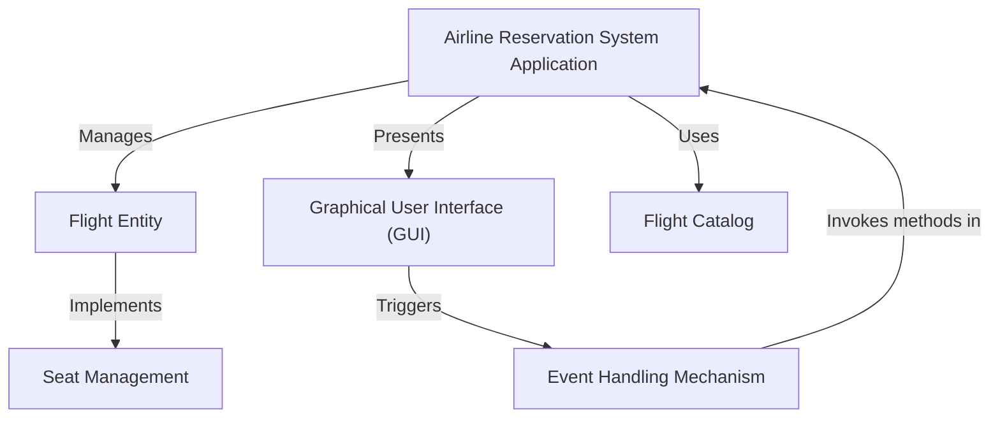
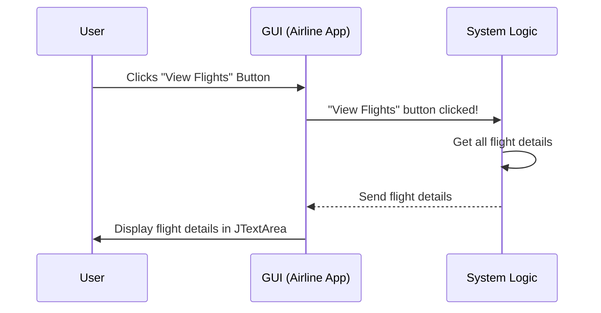
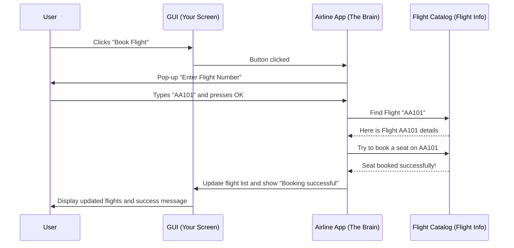

# Tutorial: Airline-Management-System

This project is an **Airline Reservation System** that lets you easily *manage your flight bookings*. You can **view available flights**, *book a seat* on a specific flight, or even **cancel a reservation** if your plans change, all through a simple visual interface.


## Visual Overview



## Chapters

1. [Graphical User Interface (GUI)
](01_graphical_user_interface__gui__.md)
2. [Airline Reservation System Application
](02_airline_reservation_system_application_.md)
3. [Flight Entity
](03_flight_entity_.md)
4. [Flight Catalog
](04_flight_catalog_.md)
5. [Seat Management
](05_seat_management_.md)
6. [Event Handling Mechanism
](06_event_handling_mechanism_.md)

---
# Chapter 1: Graphical User Interface (GUI)

Welcome to the Airline Management System tutorial! In this first chapter, we're going to explore something super important for any computer program that people use: the **Graphical User Interface (GUI)**.

### What is a GUI?

Imagine you're at an airport, and you want to book a flight. Would you prefer to shout commands at a computer screen, or would you like to see a friendly screen with buttons like "View Flights," "Book Now," and "Cancel"? Most likely, you'd choose the friendly screen!

That friendly screen, with all its buttons, text boxes, and pictures, is exactly what a **Graphical User Interface (GUI)** is!

Think of a GUI like the dashboard of a car. You don't need to understand how the engine works to turn on the lights or press the gas pedal. You just interact with the buttons, dials, and screens. Similarly, a GUI helps you use a computer program without needing to know all the complex code behind it. It's the "front desk" of our Airline Management System.

### Why Do We Need a GUI?

For our Airline Management System, a GUI solves a big problem: **how do passengers easily interact with the system?**

Without a GUI, a passenger would have to type out complicated commands like:
`bookFlight("AA101", "John Doe", "Economy");`

This is not easy for everyone! With a GUI, the passenger just sees a button that says "Book Flight," clicks it, and then maybe types the flight number into a simple box. Much easier, right?

The GUI makes our Airline Management System:
*   **Intuitive**: Easy to understand what to do.
*   **User-friendly**: Pleasant and simple to use.
*   **Accessible**: Anyone can use it without special training.

### Core Components of a GUI

Let's look at the basic building blocks that make up a GUI, especially in our Airline Management System:

| Component Type    | What it Does                                        | Analogy (Car Dashboard)                 |
| :---------------- | :-------------------------------------------------- | :-------------------------------------- |
| **Window (JFrame)** | The main "frame" or screen where everything appears. | The entire dashboard frame itself.      |
| **Text Area (JTextArea)** | A box where lots of text or information is displayed. | The screen showing your speed or radio. |
| **Buttons (JButton)** | Clickable items that make something happen.         | Buttons for turning on wipers or lights. |
| **Input Dialog (JOptionPane)** | A small pop-up box asking you for information.      | A small message popping up on the screen asking for confirmation. |

Our `AirlineReservationSystemGUI.java` file uses these components to build the visual interface. Let's see how our system puts these pieces together.

### Building Our Airline System's GUI

The core of our GUI is built using a special window, and then we add areas to show information and buttons to perform actions.

#### 1. The Main Window

Every GUI needs a main window for everything to appear in. In Java, we use `JFrame` for this. Our `AirlineReservationSystemGUI` class itself becomes this main window!

```java
import javax.swing.*; // Needed for JFrame, JButton, JTextArea, etc.
import java.awt.*;    // Needed for layout managers like BorderLayout.
// ... other imports ...

public class AirlineReservationSystemGUI extends JFrame implements ActionListener {

    // Constructor to setup the GUI
    public AirlineReservationSystemGUI() {
        // ... other code ...
        setTitle("Airline Reservation System"); // Sets the window's title
        setSize(600, 400);                     // Sets window size (width, height)
        setDefaultCloseOperation(JFrame.EXIT_ON_CLOSE); // What happens when you close the window
        setLayout(new BorderLayout());         // How components are arranged
        // ... more GUI setup ...
    }
    // ... rest of the class ...
}
```

In this code:
*   `extends JFrame` means our `AirlineReservationSystemGUI` *is* a window.
*   `setTitle`, `setSize`, `setDefaultCloseOperation`, and `setLayout` are like setting up the basic properties of our car's dashboard.

#### 2. Displaying Flight Information

We need a place to show all the available flights and their details. For this, we use a `JTextArea`.

```java
// ... inside AirlineReservationSystemGUI constructor ...
    private JTextArea flightDetailsArea; // This variable will hold our text area

    // Panel for flight info (like a section on the dashboard)
    JPanel flightPanel = new JPanel();
    // ... layout setup for flightPanel ...

    // Create the text area
    flightDetailsArea = new JTextArea(10, 50); // 10 rows, 50 columns
    flightDetailsArea.setEditable(false);      // Users can't type here
    flightPanel.add(new JScrollPane(flightDetailsArea)); // Add scrollbar if text is long
// ...
```

Here, `flightDetailsArea` is where you'll see details like "Flight Number: AA101", "Source: New York", etc. We make it `setEditable(false)` so users can only read, not change, the flight information directly. The `JScrollPane` is added so you can scroll down if there are many flights.

#### 3. Buttons for Actions

To let users *do* things, we add buttons. Each button will have a label, like "View Flights".

```java
// ... inside AirlineReservationSystemGUI constructor ...
    private JButton btnViewFlights, btnBookFlight, btnCancelBooking, btnExit;

    // Panel for buttons
    JPanel buttonPanel = new JPanel();
    // ... layout setup for buttonPanel ...

    // Create the buttons
    btnViewFlights = new JButton("View Flights");
    btnBookFlight = new JButton("Book Flight");
    btnCancelBooking = new JButton("Cancel Booking");
    btnExit = new JButton("Exit");

    // Add buttons to the panel
    buttonPanel.add(btnViewFlights);
    buttonPanel.add(btnBookFlight);
    buttonPanel.add(btnCancelBooking);
    buttonPanel.add(btnExit);
// ...
```

These lines create the actual buttons you will click on. For now, they just sit there, but soon we'll see how they become interactive.

#### 4. Getting User Input

When you want to book a flight, the system needs to know *which* flight. Instead of a permanent text box, our system uses a quick pop-up window called an `JOptionPane.showInputDialog` to ask for the flight number.

```java
// ... inside bookFlight() method ...
    private void bookFlight() {
        // This line creates a pop-up window asking for input
        String flightNumber = JOptionPane.showInputDialog(this, "Enter Flight Number to Book:");
        // The text typed by the user is stored in 'flightNumber' variable
        // ... rest of booking logic ...
    }
// ...
```
When you click "Book Flight", a small window will appear, asking "Enter Flight Number to Book:". You type your answer there.

### How the GUI Works: An Interaction Flow

So, you have a window, a text area, and some buttons. How does clicking a button actually *do* something? This is where **event handling** comes in, which is the system's way of listening for things happening (like a button click) and then reacting. We will cover this in more detail in [Event Handling Mechanism](06_event_handling_mechanism_.md). For now, let's see a simple flow:



In this diagram:
1.  The **User** (you!) clicks a button on the **GUI**.
2.  The **GUI** (our `AirlineReservationSystemGUI` window) detects this click.
3.  The GUI then tells the **System Logic** (the code that handles what to do) that a specific button was clicked.
4.  The **System Logic** does its job (like gathering all flight information).
5.  The **System Logic** sends the results back to the **GUI**.
6.  Finally, the **GUI** updates itself to show the results to the **User** (e.g., displaying the flight list in the text area).

### Making it All Run

To make our GUI application appear on your screen, we need a special part of the code, usually in the `main` method:

```java
public class AirlineReservationSystemGUI extends JFrame implements ActionListener {
    // ... all the GUI setup and methods ...

    public static void main(String[] args) {
        // This line makes sure the GUI starts correctly
        SwingUtilities.invokeLater(() -> {
            new AirlineReservationSystemGUI().setVisible(true); // Create and show the window
        });
    }
}
```
The `main` method is the starting point of any Java program. `SwingUtilities.invokeLater` is a special command that tells Java to start our GUI in a safe way, so it appears correctly. `new AirlineReservationSystemGUI().setVisible(true)` creates our GUI window and then makes it visible on your screen!

### Conclusion

In this chapter, we've learned that a **Graphical User Interface (GUI)** is the visual and interactive part of a computer program. It's like the friendly "front desk" of our Airline Management System, allowing users to easily view flights, book, and cancel bookings without needing to understand complex code. We saw how `JFrame` creates the main window, `JTextArea` displays information, `JButton` lets users take actions, and `JOptionPane` helps get user input. We also had a peek at how clicking a button triggers an action behind the scenes.

Next, we'll dive deeper into how all these parts come together to form the complete [Airline Reservation System Application](02_airline_reservation_system_application_.md) and how different pieces of our code work together!

---

<sub><sup>**References**: [[1]](https://github.com/Hack-Stone/Airline-Management-System/blob/ad4c984c7ac62b7ff91058a5eca9668a5a4cf1c3/AirlineReservationSystemGUI.java), [[2]](https://github.com/Hack-Stone/Airline-Management-System/blob/ad4c984c7ac62b7ff91058a5eca9668a5a4cf1c3/Notes.txt)</sup></sub>

# Chapter 2: Airline Reservation System Application

Welcome back! In [Chapter 1: Graphical User Interface (GUI)](01_graphical_user_interface__gui__.md), we learned about the friendly "face" of our Airline Management System – the buttons, text areas, and windows that you see and click on. But a friendly face isn't enough; we need a "brain" behind it that actually *does* things!

### What is the Airline Reservation System Application?

Imagine you're at the airport's main desk. You see screens (the GUI), and there are people (the underlying code) ready to help you. The entire desk, with all its computers, forms, and helpful staff, working together to manage flights and bookings, is like our **Airline Reservation System Application**.

This "Application" is the **central program** that brings all the pieces of our airline system together. It's the overall manager. It tells the GUI what to show, it knows about all the available flights, it handles booking and canceling tickets, and it keeps track of your reservations.

**The big problem it solves:** How do we make sure that when you click a "Book Flight" button (from the GUI), the system actually finds a flight, checks for available seats, updates the booking, and then shows you that it was successful? The Airline Reservation System Application is the conductor of this entire orchestra.

Let's think of a common task: **"A passenger wants to book a flight."** This is a perfect example of what our application manages from start to finish.

### The Main Program: Bringing It All Together

Our `AirlineReservationSystemGUI.java` file isn't just about the GUI; it actually *is* our "Airline Reservation System Application." It's one big program that contains everything needed to run the system.

When you run our program, what really happens?

#### 1. Starting the Application

Every Java program needs a starting point, like a "power on" button. This is done by a special part of the code called the `main` method.

```java
// File: AirlineReservationSystemGUI.java
public class AirlineReservationSystemGUI extends JFrame implements ActionListener {
    // ... other code ...

    public static void main(String[] args) {
        // This is where our entire application starts!
        SwingUtilities.invokeLater(() -> {
            new AirlineReservationSystemGUI().setVisible(true); // Create and show the main window
        });
    }
}
```
**What this code does:** The `main` method is like opening the airport's main desk for the day. It creates a new `AirlineReservationSystemGUI` object (which is our main window and the brain behind it) and then makes it visible on your computer screen. Once it's visible, the application is running and ready for you to interact with it!

#### 2. Setting Up the Application

When the `AirlineReservationSystemGUI` is created, it needs to set itself up. This happens in its **constructor** (a special method that runs when a new object is created).

```java
// File: AirlineReservationSystemGUI.java
public class AirlineReservationSystemGUI extends JFrame implements ActionListener {
    // ... variables for GUI components and flights ...
    private Flight[] flights = new Flight[3]; // To store our flights

    // Constructor: This runs when `new AirlineReservationSystemGUI()` is called
    public AirlineReservationSystemGUI() {
        // 1. Prepare some flights for our system
        flights[0] = new Flight("AA101", "New York", "Los Angeles", 100);
        flights[1] = new Flight("AA102", "Chicago", "San Francisco", 150);
        // ... more flights ...

        // 2. Setup the main window (as learned in Chapter 1)
        setTitle("Airline Reservation System");
        setSize(600, 400);
        setDefaultCloseOperation(JFrame.EXIT_ON_CLOSE);
        setLayout(new BorderLayout());

        // 3. Create and add all GUI buttons, text areas, etc.
        // ... code to initialize flightDetailsArea, buttons, etc. ...

        // 4. Tell buttons what to do when clicked
        btnViewFlights.addActionListener(this);
        btnBookFlight.addActionListener(this);
        // ... more button listeners ...
    }
    // ... rest of the class ...
}
```
**What this code does:** When the application starts, this constructor is like the airport manager setting up the desk.
1.  It creates a few sample flights (we'll learn more about `Flight` in [Chapter 3: Flight Entity](03_flight_entity_.md)).
2.  It sets up the main window (its title, size, and how it closes).
3.  It creates all the visual parts of the GUI (text areas, buttons, etc.) and places them on the window.
4.  Crucially, it prepares the buttons to *listen* for clicks, so when you click "Book Flight," the system knows to react (this "listening" is called event handling, which we'll explore in [Chapter 6: Event Handling Mechanism](06_event_handling_mechanism_.md)).

### How the Application Manages "Booking a Flight"

Let's trace our use case: **"A passenger wants to book a flight."**

When you, the user, interact with the system, the `AirlineReservationSystemGUI` application coordinates everything.



**Step-by-step Explanation:**

1.  **User Action:** You, the `User`, click the "Book Flight" button on the `GUI (Your Screen)`.
2.  **GUI Notifies Application:** The `GUI` (our `AirlineReservationSystemGUI` instance) detects this click and tells the main `Airline App (The Brain)` that the "Book Flight" action has occurred.
3.  **Application Asks for Input:** The `Airline App` then uses a small pop-up window (`JOptionPane`) to ask you for the specific flight number you want to book.
4.  **User Provides Input:** You type "AA101" (or any flight number) and press OK.
5.  **Application Finds Flight:** The `Airline App` then goes to its `Flight Catalog` (which is just the list of `Flight` objects it holds) and searches for the flight "AA101".
6.  **Flight Details Returned:** The `Flight Catalog` provides the details of "AA101" back to the `Airline App`.
7.  **Application Tries to Book:** The `Airline App` tells the found `Flight` object to `bookSeat()`. The `Flight` object checks if there are seats and updates its `availableSeats` count.
8.  **Booking Result:** The `Flight` object reports back to the `Airline App` whether the booking was successful.
9.  **Application Updates GUI:** Based on the booking result, the `Airline App` updates the `GUI` (by calling `displayAvailableFlights()` and `JOptionPane.showMessageDialog()`).
10. **GUI Shows Result:** The `GUI` then updates the `JTextArea` with the new flight details (showing one less seat for AA101) and displays a "Booking successful!" message to the `User`.

This entire process, from your click to the final message, is managed and coordinated by the `Airline Reservation System Application` (our `AirlineReservationSystemGUI` class).

#### The Booking Code in Action

Let's look at a simplified version of the `bookFlight` method within our `AirlineReservationSystemGUI` class:

```java
// File: AirlineReservationSystemGUI.java
// ... inside AirlineReservationSystemGUI class ...
private void bookFlight() {
    // 1. Get flight number from the user via a pop-up
    String flightNumber = JOptionPane.showInputDialog(this, "Enter Flight Number to Book:");
    if (flightNumber == null || flightNumber.trim().isEmpty()) {
        return; // User cancelled or entered nothing
    }

    // 2. Loop through all our flights to find the one
    for (Flight flight : flights) { // 'flights' is the array of Flight objects
        if (flight.flightNumber.equals(flightNumber.trim())) {
            // 3. If found, try to book a seat
            if (flight.bookSeat()) { // This calls a method on the Flight object itself
                JOptionPane.showMessageDialog(this, "Booking successful!");
                displayAvailableFlights(); // Update the display
                return; // Job done
            } else {
                JOptionPane.showMessageDialog(this, "Sorry, no seats available.");
                return; // Job done
            }
        }
    }
    // If we reach here, flight was not found
    JOptionPane.showMessageDialog(this, "Flight not found.");
}
```
**What this code does:** This method is the "how-to-book-a-flight" guide for our application.
1.  It first pops up a window asking for the flight number.
2.  Then, it looks through all the flights it knows about (stored in the `flights` array).
3.  When it finds the matching flight, it tells that specific `Flight` object to "book a seat" using `flight.bookSeat()`. (We'll see how `Flight` manages seats in [Chapter 5: Seat Management](05_seat_management_.md)).
4.  Finally, it tells the user if the booking worked or failed, and updates the flight list on the screen.

### Conclusion

In this chapter, we've understood that the **Airline Reservation System Application** is the main program that acts as the central control for our entire system. It's not just the visual GUI, but the "brain" that coordinates all actions, manages flight data, processes bookings, and makes sure everything runs smoothly. We saw how it starts, sets itself up, and orchestrates tasks like booking a flight, bringing together the GUI, flight information, and booking rules.

Next, we'll zoom in on one of the most important pieces of information the application manages: the details about each [Flight Entity](03_flight_entity_.md) itself!

---

<sub><sup>**References**: [[1]](https://github.com/Hack-Stone/Airline-Management-System/blob/ad4c984c7ac62b7ff91058a5eca9668a5a4cf1c3/AirlineReservationSystemGUI.java), [[2]](https://github.com/Hack-Stone/Airline-Management-System/blob/ad4c984c7ac62b7ff91058a5eca9668a5a4cf1c3/Notes.txt)</sup></sub>
