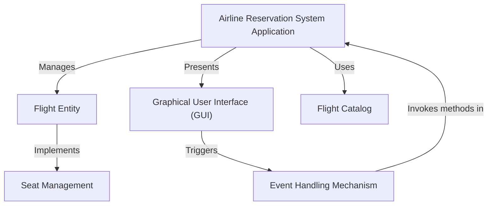
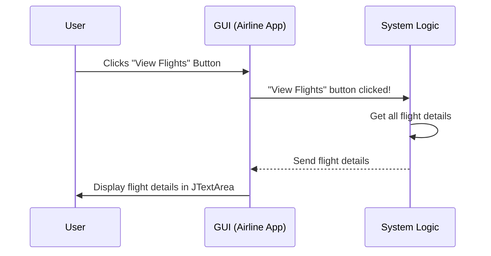

# Tutorial: Airline-Management-System

This project is an **Airline Reservation System** that lets you easily *manage your flight bookings*. You can **view available flights**, *book a seat* on a specific flight, or even **cancel a reservation** if your plans change, all through a simple visual interface.


## Visual Overview



## Chapters

1. [Graphical User Interface (GUI)
](01_graphical_user_interface__gui__.md)
2. [Airline Reservation System Application
](02_airline_reservation_system_application_.md)
3. [Flight Entity
](03_flight_entity_.md)
4. [Flight Catalog
](04_flight_catalog_.md)
5. [Seat Management
](05_seat_management_.md)
6. [Event Handling Mechanism
](06_event_handling_mechanism_.md)

---
# Chapter 1: Graphical User Interface (GUI)

Welcome to the Airline Management System tutorial! In this first chapter, we're going to explore something super important for any computer program that people use: the **Graphical User Interface (GUI)**.

### What is a GUI?

Imagine you're at an airport, and you want to book a flight. Would you prefer to shout commands at a computer screen, or would you like to see a friendly screen with buttons like "View Flights," "Book Now," and "Cancel"? Most likely, you'd choose the friendly screen!

That friendly screen, with all its buttons, text boxes, and pictures, is exactly what a **Graphical User Interface (GUI)** is!

Think of a GUI like the dashboard of a car. You don't need to understand how the engine works to turn on the lights or press the gas pedal. You just interact with the buttons, dials, and screens. Similarly, a GUI helps you use a computer program without needing to know all the complex code behind it. It's the "front desk" of our Airline Management System.

### Why Do We Need a GUI?

For our Airline Management System, a GUI solves a big problem: **how do passengers easily interact with the system?**

Without a GUI, a passenger would have to type out complicated commands like:
`bookFlight("AA101", "John Doe", "Economy");`

This is not easy for everyone! With a GUI, the passenger just sees a button that says "Book Flight," clicks it, and then maybe types the flight number into a simple box. Much easier, right?

The GUI makes our Airline Management System:
*   **Intuitive**: Easy to understand what to do.
*   **User-friendly**: Pleasant and simple to use.
*   **Accessible**: Anyone can use it without special training.

### Core Components of a GUI

Let's look at the basic building blocks that make up a GUI, especially in our Airline Management System:

| Component Type    | What it Does                                        | Analogy (Car Dashboard)                 |
| :---------------- | :-------------------------------------------------- | :-------------------------------------- |
| **Window (JFrame)** | The main "frame" or screen where everything appears. | The entire dashboard frame itself.      |
| **Text Area (JTextArea)** | A box where lots of text or information is displayed. | The screen showing your speed or radio. |
| **Buttons (JButton)** | Clickable items that make something happen.         | Buttons for turning on wipers or lights. |
| **Input Dialog (JOptionPane)** | A small pop-up box asking you for information.      | A small message popping up on the screen asking for confirmation. |

Our `AirlineReservationSystemGUI.java` file uses these components to build the visual interface. Let's see how our system puts these pieces together.

### Building Our Airline System's GUI

The core of our GUI is built using a special window, and then we add areas to show information and buttons to perform actions.

#### 1. The Main Window

Every GUI needs a main window for everything to appear in. In Java, we use `JFrame` for this. Our `AirlineReservationSystemGUI` class itself becomes this main window!

```java
import javax.swing.*; // Needed for JFrame, JButton, JTextArea, etc.
import java.awt.*;    // Needed for layout managers like BorderLayout.
// ... other imports ...

public class AirlineReservationSystemGUI extends JFrame implements ActionListener {

    // Constructor to setup the GUI
    public AirlineReservationSystemGUI() {
        // ... other code ...
        setTitle("Airline Reservation System"); // Sets the window's title
        setSize(600, 400);                     // Sets window size (width, height)
        setDefaultCloseOperation(JFrame.EXIT_ON_CLOSE); // What happens when you close the window
        setLayout(new BorderLayout());         // How components are arranged
        // ... more GUI setup ...
    }
    // ... rest of the class ...
}
```

In this code:
*   `extends JFrame` means our `AirlineReservationSystemGUI` *is* a window.
*   `setTitle`, `setSize`, `setDefaultCloseOperation`, and `setLayout` are like setting up the basic properties of our car's dashboard.

#### 2. Displaying Flight Information

We need a place to show all the available flights and their details. For this, we use a `JTextArea`.

```java
// ... inside AirlineReservationSystemGUI constructor ...
    private JTextArea flightDetailsArea; // This variable will hold our text area

    // Panel for flight info (like a section on the dashboard)
    JPanel flightPanel = new JPanel();
    // ... layout setup for flightPanel ...

    // Create the text area
    flightDetailsArea = new JTextArea(10, 50); // 10 rows, 50 columns
    flightDetailsArea.setEditable(false);      // Users can't type here
    flightPanel.add(new JScrollPane(flightDetailsArea)); // Add scrollbar if text is long
// ...
```

Here, `flightDetailsArea` is where you'll see details like "Flight Number: AA101", "Source: New York", etc. We make it `setEditable(false)` so users can only read, not change, the flight information directly. The `JScrollPane` is added so you can scroll down if there are many flights.

#### 3. Buttons for Actions

To let users *do* things, we add buttons. Each button will have a label, like "View Flights".

```java
// ... inside AirlineReservationSystemGUI constructor ...
    private JButton btnViewFlights, btnBookFlight, btnCancelBooking, btnExit;

    // Panel for buttons
    JPanel buttonPanel = new JPanel();
    // ... layout setup for buttonPanel ...

    // Create the buttons
    btnViewFlights = new JButton("View Flights");
    btnBookFlight = new JButton("Book Flight");
    btnCancelBooking = new JButton("Cancel Booking");
    btnExit = new JButton("Exit");

    // Add buttons to the panel
    buttonPanel.add(btnViewFlights);
    buttonPanel.add(btnBookFlight);
    buttonPanel.add(btnCancelBooking);
    buttonPanel.add(btnExit);
// ...
```

These lines create the actual buttons you will click on. For now, they just sit there, but soon we'll see how they become interactive.

#### 4. Getting User Input

When you want to book a flight, the system needs to know *which* flight. Instead of a permanent text box, our system uses a quick pop-up window called an `JOptionPane.showInputDialog` to ask for the flight number.

```java
// ... inside bookFlight() method ...
    private void bookFlight() {
        // This line creates a pop-up window asking for input
        String flightNumber = JOptionPane.showInputDialog(this, "Enter Flight Number to Book:");
        // The text typed by the user is stored in 'flightNumber' variable
        // ... rest of booking logic ...
    }
// ...
```
When you click "Book Flight", a small window will appear, asking "Enter Flight Number to Book:". You type your answer there.

### How the GUI Works: An Interaction Flow

So, you have a window, a text area, and some buttons. How does clicking a button actually *do* something? This is where **event handling** comes in, which is the system's way of listening for things happening (like a button click) and then reacting. We will cover this in more detail in [Event Handling Mechanism](06_event_handling_mechanism_.md). For now, let's see a simple flow:



In this diagram:
1.  The **User** (you!) clicks a button on the **GUI**.
2.  The **GUI** (our `AirlineReservationSystemGUI` window) detects this click.
3.  The GUI then tells the **System Logic** (the code that handles what to do) that a specific button was clicked.
4.  The **System Logic** does its job (like gathering all flight information).
5.  The **System Logic** sends the results back to the **GUI**.
6.  Finally, the **GUI** updates itself to show the results to the **User** (e.g., displaying the flight list in the text area).

### Making it All Run

To make our GUI application appear on your screen, we need a special part of the code, usually in the `main` method:

```java
public class AirlineReservationSystemGUI extends JFrame implements ActionListener {
    // ... all the GUI setup and methods ...

    public static void main(String[] args) {
        // This line makes sure the GUI starts correctly
        SwingUtilities.invokeLater(() -> {
            new AirlineReservationSystemGUI().setVisible(true); // Create and show the window
        });
    }
}
```
The `main` method is the starting point of any Java program. `SwingUtilities.invokeLater` is a special command that tells Java to start our GUI in a safe way, so it appears correctly. `new AirlineReservationSystemGUI().setVisible(true)` creates our GUI window and then makes it visible on your screen!

### Conclusion

In this chapter, we've learned that a **Graphical User Interface (GUI)** is the visual and interactive part of a computer program. It's like the friendly "front desk" of our Airline Management System, allowing users to easily view flights, book, and cancel bookings without needing to understand complex code. We saw how `JFrame` creates the main window, `JTextArea` displays information, `JButton` lets users take actions, and `JOptionPane` helps get user input. We also had a peek at how clicking a button triggers an action behind the scenes.

Next, we'll dive deeper into how all these parts come together to form the complete [Airline Reservation System Application](02_airline_reservation_system_application_.md) and how different pieces of our code work together!

---

<sub><sup>**References**: [[1]](https://github.com/Hack-Stone/Airline-Management-System/blob/ad4c984c7ac62b7ff91058a5eca9668a5a4cf1c3/AirlineReservationSystemGUI.java), [[2]](https://github.com/Hack-Stone/Airline-Management-System/blob/ad4c984c7ac62b7ff91058a5eca9668a5a4cf1c3/Notes.txt)</sup></sub>

